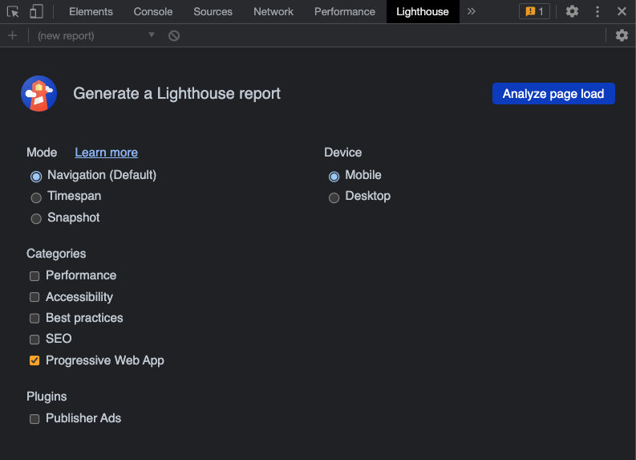

# Create Pokemon PWA application with create-react-app

## Things I have done...

- Create service worker

## Nice to have URL's

#### Service Worker API -

[https://developer.mozilla.org/en-US/docs/Web/API/Service_Worker_API](https://developer.mozilla.org/en-US/docs/Web/API/Service_Worker_API)

#### Url used in this build 🔗

- ```
  https://pokeapi.co/api/v2/pokemon?limit=151
  ```
- ```
  https://img.pokemondb.net/artwork/large/${poke.name}.jpg
  ```

## Good to know/have 🤔

<details>
  <summary>Lighthouse 🤔</summary>
    
  - Lighthouse extension in dev tools
    
  - If Server Worker is running, you should have "Service Workers" tab
    

</details>

<details>

  <summary>How to use LighHouse in Dev Tools 💡🏠</summary>
    
  - Clicking buttton "Analyze page load" will display errors that have to be fixed
  
  - Error I get know, right after implementing Service Worker. I have to fulfill these requirements for PWA application to work correctly ⛔️
  

</details>

<details>

  <summary>Make PWA installable</summary>
    
  - We have now fulfilled the requirement to make application installable
  
  - Install PWA application
  
  - Open PWA application
  
  
</details>
